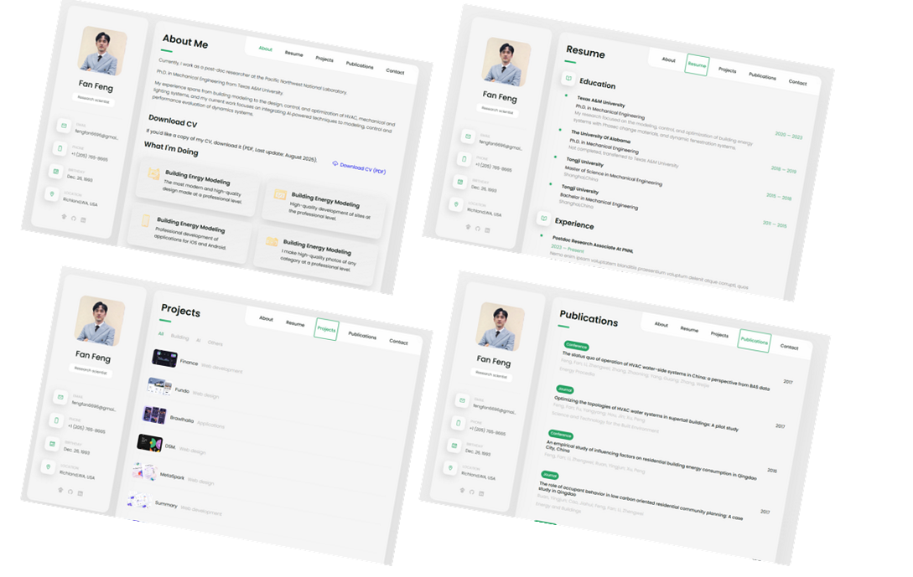

# Fan Feng personal website

This website is redesigned based on vCard's personl portfolio (https://codewithsadee.github.io/vcard-personal-portfolio/). Welcome to use this as template for your site. 


## Demo



## Prerequisites

Before you begin, ensure you have met the following requirements:

* [Git](https://git-scm.com/downloads "Download Git") must be installed on your operating system.

## Installing this website

To install this, follow these steps:

Linux and macOS:

```bash
sudo git clone https://github.com/Fan-Feng/Fan-Feng.github.io.git folder_name
```

Windows:

```bash
git clone https://github.com/Fan-Feng/Fan-Feng.github.io.git  folder.name
```

## Contact

If you want to contact me you can reach me at fengfan6696@gmail.com

## License

MIT
